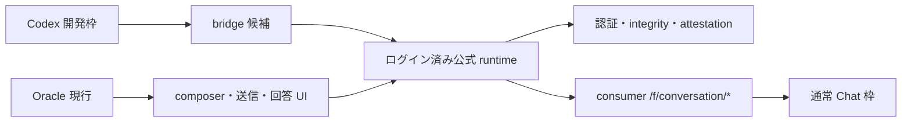

# ChatGPT Chat枠 CDP bridge 調査計画

作成日: 2026-07-13

## 目的

Codex 開発枠から、ChatGPT 公式ページのログイン済みランタイムを介して通常 Chat へプロンプトを送り、Chat 枠の応答を UI 構造へ依存せず回収できるかを検証する。

ブラウザは画面操作対象ではなく、認証・integrity・attestation・conversation lifecycle を所有する実行環境として扱う。

## 理想順位（実現性とは独立して固定）

1. **ページ内部の正規 conversation client 呼出し（旧「方式2」）**
   - 高水準の conversation intent を正規 client へ渡す。
   - request 構築、integrity、attestation、conduit token、stream、conversation 継続は公式ページ側へ委ねる。
   - composer、送信ボタン、回答 DOM を使わない。
2. **CDP Fetch interception（旧「方式1」）**
   - 公式ページが生成する通信を CDP で捕捉し、prepare と stream の整合性を保って入力を制御する。
   - 公式ページに認証・integrity を残すが、wire schema と token lifecycle の理解をこちらが担う。
3. **最小 UI trigger＋通信差し替え（旧「方式3」）**
   - UI は fresh request を発生させる最小 trigger に限定し、実データと応答回収は通信層で扱う。
   - composer／送信イベント依存が残るため最終手段とする。

下位方式が先に動いても順位は変えない。上位方式の不成立条件を再現可能な証拠で確定した場合だけ、次順位を採用候補へ繰り上げる。

## 成功条件

- Codex 側から任意のプロンプトを通常 Chat へ送れる。
- 応答本文と完了状態を DOM の回答表示に依存せず回収できる。
- 新規 conversation と既存 conversation 継続の双方を扱える。
- 実行が Chat 枠を消費し、Codex rate limit を消費しないことを確認できる。
- 初回ログイン後、方式1では composer・ボタン・回答 DOM を操作しない。
- cookie、access token、refresh token、attestation、conduit token を永続化・ログ出力しない。
- challenge 更新と認証更新は公式ページ自身へ委ねる。
- schema drift、integrity rejection、stream 異常を明示エラーとして検出する。
- 連続実行で token 再利用、conversation 混線、下書き混入が起きない。

## 非目標

- ChatGPT consumer private API をブラウザ外で再実装しない。
- Cloudflare／attestation／integrity mechanism を回避しない。
- 認証情報を Oracle、ChatGPT app、Chrome の管理領域外へ複製しない。
- 調査段階で Oracle 本体や `~/.oracle/` の正典設定を変更しない。
- 画面レイアウトや自然言語ラベルに依存する汎用 UI agent を作らない。
- 本計画では production connector の実装・配布・常駐化を行わない。

## 既知の罠

- ChatGPT Web は true headless Chrome を Cloudflare が遮断する。実験は headful/offscreen を前提とする。
- Oracle の `hideWindow` は描画停止により送信不発と下書き混入を起こす。使用しない。
- GPT-5.6 UI のモデルラベル操作は Oracle 0.15.2 では不安定。モデル UI は触らない。
- `/f/conversation/prepare` と stream request が payload、conduit token、integrity proof で結合している可能性がある。
- CDP の Network/Fetch ログには cookie・authorization・proof token が含まれ得る。生ログをファイル保存しない。
- Chrome DevTools page target の WebSocket upgrade は `Origin` header 付き接続を拒否する場合がある。loopback の raw CDP client では不要な `Origin` を送らない。
- response body や conversation 本文にも個人情報が含まれ得る。probe は専用の無害な短文だけを使う。
- app/browser bundle の minified symbol 名は更新で変わる。symbol 名一致だけを公開契約として扱わない。

## 調査レーン

### Phase 0 — ベースラインと境界固定

- [x] git 状態、remote、stash、shallow 状態を確認する。
- [x] 既存 `rag/`、Oracle 正典、caveat を確認する。
- [x] App Server が `codex` quota であり consumer Chat の代替でないことを固定する。
- [x] 調査対象の ChatGPT Web／ChatGPT app／Oracle browser の責務境界を図にする。
- [x] 秘密情報を標準出力・ファイルへ残さない観察手順を確定する。

秘密値を含む header/body はファイルへ保存せず、観察コード内で endpoint、method、field名、event順へ即時射影する。生の CDP event、response body、cookie、token は標準出力へ出さない。

### Phase 1 — 静的 discovery（送信なし）

- [x] ChatGPT app bundle 内の consumer conversation client の入口、状態管理、transport boundary を抽出する。
- [x] `/f/conversation/prepare`、stream、resume の呼出し関係を整理する。cancel の wire endpoint は未確定のため Phase 2 へ持ち越す。
- [x] `isEverydayWorkMode`、通常 Chat、temporary Chat、handoff の境界を整理する。
- [x] Web 版と desktop app 版で共有される client contract と desktop 固有 attestation を分離する。Web の同一実装共有は未確認、desktop 固有 branch は確認済み。
- [x] 方式1の候補入口を「安定した action/dispatcher」「内部 client object」「minified function」の順で評価する。

静的 discovery の暫定裁定:

- desktop consumer client は `prepareIntegrity()` → `POST /f/conversation/prepare` → `conduit_token` 取得 → `POST /f/conversation` → SSE 処理を自身で行う。resume 入口も存在する。
- 高水準 send 関数は request 構築、conversation state、stream decode、完了処理を一括して正規 client へ委ねられるため、理想順位1の候補として残る。
- ただし live `AppScope` は React context 内にあり、安定した global dispatcher／公開 IPC は確認できなかった。minified export を直接呼ぶだけでは足りず、実行中 scope の取得方法が成立判定の核心になる。
- preload bridge に consumer Chat の直接送信 IPC はない。Chat → Work/Codex の handoff はあるが、Codex → Chat の逆方向入口は確認できない。
- Web 版は desktop と別 asset 群を使用する。既存ページの loaded asset から desktop 固有 marker は確認できず、共有実装の有無は passive CDP で再評価する。

### Phase 2 — passive CDP characterization（送信内容の変更なし）

- [x] Chrome/CDP の適切な入口の skill 契約を読む。
- [x] 現在利用可能な runtime の CDP 可否を非破壊で確認する。通常 Chrome と ChatGPT desktop app は remote debugging 無効、既存 port 9222 の別 Chrome には ChatGPT page target がない。
- [x] プロジェクト所有・git 管理外の専用 profile を作成し、remote debugging 有効な headful Chrome を `https://chatgpt.com/` で起動する。
- [x] ログイン済み公式 ChatGPT ページへ、認証情報を出力しない CDP 接続を確立する。`/api/auth/session` の status と認証有無だけをpage内で射影し、HTTP 200／authenticated=trueを確認した。
- [x] main worldでReact fiber、公式ES module、現在のconversationモデルへ到達できることを、本文・ID・tokenを出力せず確認する。
- [x] 手動probeはスキップした。専用probeを内部clientから送信し、同じURL・method・event順・body field名をメモリ内で観察できたため、UIを使う手動送信を追加しなかった。
- [x] 専用probeについて、endpoint path・method・event順・body field名を値なしで観察する。
- [x] prepare／stream／completion／history persistence の状態遷移を記録する。既存conduitがある継続turnではstream完了後に次turn用prepareが走る。
- [x] promptはsubmission builderがuser messageへ変換し、公式factory由来client conversation idとparent message idを結び、senderがintegrity／既存conduitを付与する関係として整理した。値は保存していない。
- [x] SSE／stream responseと公式conversation stateからfinal assistant messageと完了を決定する契約を特定する。

### Phase 3 — 方式1: 正規 conversation client の非 UI 起動

- [x] ページ内の公式submission builderと高水準senderから新規 conversation を開始できるか検証する。
- [x] 同じ入口で既存 conversation の継続ができるか検証する。
- [x] UI composer／button を一切触らずに stream 完了まで到達できるか検証する。
- [x] 失敗応答を故障注入で確認した。未認証sessionは`AUTH_REQUIRED`、空の完了SSEは`STREAM_INCOMPLETE`になった。challenge refreshとrate limitは忠実な人工再現ができないため未注入とし、自然発生時に正規clientの挙動を再検証する。
- [x] 公式runtimeから利用可能model catalogをUIなしで取得し、model ID、表示名、既定effort、選択可能effortを値の由来付きで整理する。
- [x] `requestedModelId`と`thinkingEffort`を明示したturnを実行し、assistant metadataで反映を確認する。
- [x] model未指定・effort未指定は公式default解決へ委ね、未知model／未対応effortは送信前にfail-closedで拒否する契約を定める。
- [x] `serviceTier`をmodel／thinking effortと別軸として扱い、無指定時に勝手なtier固定をしない。
- [x] 方式1は公式factory→builder→sender→state APIで新規・継続・model／effort指定まで成立すると証拠付きで裁定した。

active probe直前の成立仮説:

- Web版の読込済み公式assetに `/f/conversation/prepare`、`conduit_token`、`parent_message_id` を含むtransport実装がある。
- 同assetはprepare関数 `JY`、高水準sender `kF` をES module exportとして公開している。`kF` はintegrity、optimistic state、prepare/conduit、request、stream完了を公式client内で処理する。
- conversation画面assetはsubmission builder `DP` をexportする。これはcomposer UI eventを必要とせず、conversation、content、mode等から正規request parametersを構築する。
- 現在のconversationモデルはReact fiberのpropsから型形状で取得できる。会話本文・conversation idは観察していない。
- active probeでは `DP` → `kF` を同一page main world内で呼び、回答回収はまず公式stateとCDP eventを観察する。DOM composer、button、回答表示は使用しない。

active probe 1 実測（2026-07-13）:

- 承認件数: 1件。送信文は既定probe文。
- 新規conversation preflight: pathname `/`、conversation object 1件、server id未発行、mode `primary_assistant`。
- `DP` がuser messageを含む正規completion parametersを構築した。
- `kF` を `eventSource: "url"` で呼び、例外なくstream完了までresolveした。
- 公式state getter `Jjt/Sh` とmessage tree API `Bjt.getLastAssistantMessage` から、DOMを使わずassistant messageを回収した。
- 結果: role `assistant`、status `finished_successfully`、`end_turn=true`、text `BRIDGE_OK`、完全一致。
- 履歴: server conversationが作成された。検証後、公式API clientの `safePatch` で `is_archived: true` を設定。archive成功、delete未実施。
- 当時の未達: CDP Network observerのpath filterが実URL prefixを狭く仮定したためendpoint event順を取得できなかった。後続probeではprefixを固定しないfilterへ直し、Phase 2の該当項目を完了した。

active probe 2・3 実測（2026-07-13）:

- 同一conversationを公式clientで一時unarchiveし、`DP` → `kF` で継続probeを実行。`CONTINUE_OK`、`finished_successfully`、`end_turn=true`を公式stateから回収した。
- 独立CDP observerを装着した追加probeでは、`NETWORK_OK`を公式stateとSSE response bodyの両方で確認した。
- 継続turnのevent順は `POST /f/conversation` request → HTTP 200 `text/event-stream` → `POST /f/conversation/prepare` request → stream finished → prepare HTTP 200 JSON → prepare finished。
- これは既存conduitを現在turnに使用し、stream完了後に次turn用prepareを行う実装と整合する。
- 検証後、同一conversationを再archive。delete未実施。

fiber依存反証probe（2026-07-13）:

- 公式export `_gt/TT(clientThreadId)` と `Hjt.initThread(...)` だけでconversation model／threadを作成し、DOM・fiberを一切参照せず `DP` → `kF` を実行した。
- server id signalとlocal assistant placeholderまでは作られたが、assistant本文・status・end_turnは確定しなかった。
- 公式server read-backはaccess拒否、archiveは`Conversation not found`。server conversationとして成立していない。
- local threadを公式storeから削除し、一時page参照を破棄。専用Chromeを新規Chat画面へ戻した。delete APIは未実施。
- よって plain UUIDを渡す `TT + initThread` は標準new-conversation lifecycleの代替にならない。この時点の暫定結論としてReact fiber依存が残ると判断したが、下記の公式factory probeで反証された。

公式factory probe／2turn chain（2026-07-13）:

- bundleの標準new-conversation lifecycleを逆引きし、conversation factory `ggt/Vgt`、公式client ID generator `cMt/yh`、thread initializer `Hjt.initThread` を特定した。
- `ggt/Vgt` は内部で公式client IDを生成する。実測では`WEB:` client IDとして識別され、高水準senderのfirst-completion分岐と一致した。ID実値は保存していない。
- DOM・React fiberを参照せず、factory → initThread → `DP` → `kF` を実行。`FACTORY_OK`、`finished_successfully`、`end_turn=true`を公式stateから回収した。
- 同じfactory生成conversationへ2turnを連続実行し、`FACTORY_CHAIN_1`、`FACTORY_CHAIN_2`がともに完全一致・完了した。
- Networkは `/f/conversation` HTTP 200 SSE → post-completion `/f/conversation/prepare` HTTP 200 JSON。
- probe conversationはいずれもserver `is_archived=true`をread-backで確認。delete未実施。page一時stateを削除し、新規Chat画面へ戻した。
- 以上により、方式1は新規作成・継続・応答回収までDOM／React fiberなしで成立する。plain UUID失敗は、公式client ID factoryを迂回してはならないというnegative characterizationになる。

model／thinking effort選択probe（2026-07-13）:

- 公式clientの `GET /models` をpage内から呼び、account/runtime固有catalogを取得した。catalogは `slug`、title、reasoning type、`thinking_efforts`、`default_thinking_effort`、`configurable_thinking_effort`、`is_work_mode_model` を持つ。
- 取得時点の通常Chat既定modelは `gpt-5-5`。この値は固定せずruntime catalogを正とする。
- 通常Chat probeとして `requestedModelId: gpt-5-6-thinking`、`thinkingEffort: min`、`serviceTier: undefined` を指定した。
- assistant metadataは `resolved_model_slug`、`model_slug`、`default_model_slug` がすべて `gpt-5-6-thinking`、`thinking_effort` が `min`。応答は `MODEL_EFFORT_OK`、`finished_successfully`、`end_turn=true`。
- 非対応例 `gpt-5-5-instant + max` はlive catalog検証でconversation作成前・sender呼出し前に拒否した。defaultへのfallbackなし。
- probe conversationはserver `is_archived=true`をread-backで確認。delete未実施。

### Phase 4 — 方式2: CDP Fetch interception

- [x] スキップ裁定。Phase 3が成立し、minified symbol固定ではなくsemantic discoveryで入口を解決できたため、着手条件が成立しない。
- [x] prepare捕捉、prompt差し替え、prepare／stream同時差し替え、token lifecycleの実装検証は非採用方式のため実施しない。
- [x] 方式2は技術的候補のまま非採用。方式1が不成立へ変わった場合だけ再開する。

### Phase 5 — 方式3: 最小 UI trigger

- [x] スキップ裁定。Phase 3が成立したため着手条件が成立しない。
- [x] composer発見、ダミー入力、UI送信、通信差し替えの実装検証は非採用方式のため実施しない。
- [x] Oracle現行方式との依存面積比較はPhase 6の比較表で裁定した。

### Phase 6 — 反証・裁定・還流

- [x] 「方式1は内部clientなのでUI非依存」という主張を、DOM/event依存の残存有無で反証する。plain UUIDでは不成立だったが、公式factoryを使う新規作成・継続・応答回収はDOM／React fiberなしで成立し、主張は条件付きで生き残った。
- [x] 方式2の「wire操作だけで安定」は採用しない。integrity／prepare／streamの結合とprivate schema driftをbridge側が引き受けるため、方式1より依存責務が大きい。
- [x] 方式3の「十分」は採用しない。composer／event／描画状態／下書きへの依存が残り、Oracleの既知failure modeを解消しない。
- [x] 通信がconsumer `/f/conversation`へ到達し、Codex App Serverを通らないことを観測した。Chat／Codex双方の直接quota counterは公開観測できないため、枠の増減そのものは未確認として残す。
- [x] 方式ごとの成立条件、棄却理由、残余リスクを下表にまとめた。
- [x] 重要な一次情報・実測を `rag/` と `rag/INDEX.md` へ還流した。
- [x] 別の実装計画とF/A/H配置を `docs/archive/2026-07-13-gpt-connector-implementation-plan.md` に作成してから実装へ進んだ。

| 理想順位 | 方式 | 裁定 | 依存面積と主なfailure mode |
|---:|---|---|---|
| 1 | ページ内部の正規conversation client | 採用 | 非公開asset／semantic signature／内部schema drift。UI、DOM、React fiberには依存しない。 |
| 2 | CDP Fetch interception | 条件付き候補・今回は非採用 | wire schema、prepare／stream整合、integrity／conduit lifecycleをbridge側が引き受ける。 |
| 3 | 最小UI trigger＋通信差し替え | 非採用 | selector、event、描画状態、下書き混入が残り、Oracleより依存面積を十分に縮めない。 |

## 外部状態を変える probe の承認境界

通常 Chat への test message 送信は、Chat 履歴の作成／更新と Chat 枠消費を伴う。Phase 2 以降で初回送信が必要になった時点で、目的・送信文・件数・履歴の後始末をクオ君へ示し、明示承認後に実行する。

既定 probe 文:

> CDP bridge characterization probe. Reply with exactly: BRIDGE_OK

probe conversation は検証完了後に archive を優先し、delete は別承認なしに行わない。

2026-07-13 クオ君裁定: 本調査計画内の無害な専用probe送信、一時unarchive、再archiveは都度承認を不要とする。delete、個人conversationへの送信、計画外の外部変更はこの包括許可に含めない。

## 証拠の扱い

- 永続化してよい: endpoint path、HTTP method、field名、event名、状態遷移、エラー種別、所要時間、app/browser version。
- 永続化しない: cookie、authorization header、token実値、attestation実値、conduit実値、account id、個人conversation本文、生のnetwork dump。
- 生データが必要な解析はメモリ内または権限制限した一時領域で行い、調査単位の終了時に削除する。
- 外部公式仕様は MarkItDown で `rag/**/raw/` に保存し、バイト数で成功判定する。

## 完了条件

- 三方式すべてについて、理想順位を維持した成立性判定がある。
- 少なくとも方式1の候補入口と不成立条件が明らかになっている。
- active probe を行った場合、送信数・結果・後始末が記録されている。
- 採用候補が、Chat枠・非UI・秘密非永続化の三条件を満たすか明示されている。
- 未確認事項を成功扱いせず、再訪条件と次の実装計画への入口が残っている。

## 現在の方式裁定

1. **ページ内部の正規conversation client呼出し: 成立。採用候補。** 公式factory、submission builder、高水準sender、公式state APIだけで新規・継続・応答回収が可能。
2. **CDP Fetch interception: 未着手。** 方式1が成立したため、優先順位規則により降りない。
3. **最小UI trigger＋通信差し替え: 未着手。** 方式1・2不成立条件を満たさないため降りない。

方式1の残余リスクは、非公開ES module、asset hash、minified export名、内部request schema、integrity／attestation、公式Web runtime変更への依存である。実装時はexport名固定ではなく、関数source／契約形状によるsemantic discoveryとfail-closedなversion gateが必要。

採用候補の機能要件には、通常Chat promptだけでなく、アカウントで利用可能なmodelとthinking effortの明示選択を含める。model catalogに存在しない組合せを暗黙defaultへ落とさない。

model選択契約:

1. 各sessionまたは短いTTLで公式`/models`を取得し、固定model一覧を埋め込まない。
2. 通常Chatでは `is_work_mode_model=true` を除外する。model picker互換表示ではenabled version／presetも考慮する。
3. model未指定なら `default_model_slug` と公式clientのdefault解決へ委ねる。
4. effort指定時は対象modelの `thinking_efforts[].thinking_effort` に含まれることを要求する。未対応なら送信前エラー。
5. effort未指定ならfieldを省略し、公式defaultへ委ねる。
6. `serviceTier`は別field。利用者が指定しない限り省略する。
7. catalog drift、未知model、未知effort、Work-only modelはfallbackせずfail-closed。

## 完了時の実行境界

remote debuggingを有効にした専用headful Chromeとログイン済みprofileを使用し、通常Chrome、ChatGPT desktop app、Oracle管理profileは変更していない。

専用profileはproject直下の `.browser-profile/` に置き、`/.browser-profile/` を `.gitignore` へ登録済み。CDPはloopbackの `127.0.0.1:9223` だけで待受ける。認証情報は観察・複製していない。
