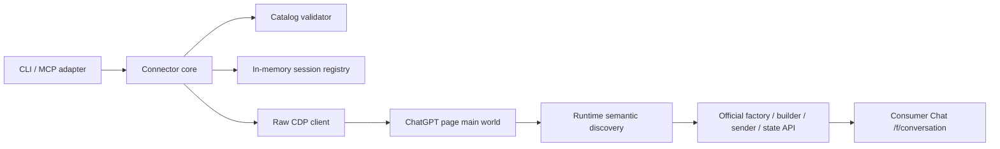

# GPT Connector 実装計画

作成日: 2026-07-13

## 目的

Codex開発枠から、ログイン済みChatGPT公式Web runtimeを介して通常Chatを呼び出すローカルconnectorを実装する。

調査で成立した理想順位1「ページ内部の正規conversation client呼出し」だけを採用し、公式factory → thread initializer → submission builder → high-level sender → official state getterの経路を製品化する。

## 固定優先順位と実装裁定

1. **ページ内部の正規conversation client呼出し: 採用。**
2. **CDP Fetch interception: 実装しない。** 1が成立したため降りない。
3. **最小UI trigger＋通信差し替え: 実装しない。** 1が成立したため降りない。

方式1が将来bundle driftで不成立になった場合も、方式2・3へ自動fallbackしない。明示エラーと診断情報を返し、別調査・別承認で裁定する。

## 公開契約

### `models`

現在のaccount/runtimeで利用可能な通常Chat modelを返す。

- model ID、表示名、reasoning type、選択可能thinking effort、既定modelを返す。
- `is_work_mode_model=true`を通常Chat一覧から除外する。
- catalogは公式`/models`から実行時取得し、固定一覧へfallbackしない。

### `chat`

入力:

- `prompt`: 必須文字列。
- `model`: 任意。live catalog上の通常Chat model ID。
- `effort`: 任意。選択modelが公開するthinking effort。
- `sessionId`: 任意。process内の既存session handle。
- `keepOpen`: 任意、既定false。

出力:

- assistant本文。
- status、endTurn、resolved model、resolved effort。
- `keepOpen=true`の場合だけopaque `sessionId`。

挙動:

- sessionなしなら公式factoryで新規conversationを作る。
- sessionありなら同じconversation modelを継続する。
- `keepOpen=false`なら成功・失敗を問わず可能な範囲でarchiveし、handleを破棄する。
- model／effort未指定はfieldを省略し、公式defaultへ委ねる。
- 未知model、Work-only model、未対応effortはconversation作成前に拒否する。

### `close`

- process内sessionをarchiveし、handleを破棄する。
- deleteは提供しない。
- 未知sessionは明示エラー。

## セキュリティ・秘密境界

- Chrome profileはproject所有のgit管理外`/.browser-profile/`に置く。
- cookie、authorization、access／refresh token、integrity、attestation、conduit tokenを取得・ログ・永続化しない。
- CDP eventの生dumpを保存しない。
- server conversation IDはpage main world内とprocess memory内だけで扱い、ログ・戻り値・状態ファイルへ出さない。
- callerへ返すsession IDは乱数のopaque handleとし、server／client thread IDを含めない。
- prompt／responseのログは既定OFF。エラーには本文を含めない。
- CDPはloopbackだけを許可する。外部hostのdebug endpointは拒否する。

## failure contract

- `AUTH_REQUIRED`: 専用Chromeでログインが必要。
- `CDP_UNAVAILABLE`: endpointまたはChatGPT page targetがない。
- `RUNTIME_DRIFT`: asset／export契約が一意に発見・検証できない。
- `MODEL_NOT_AVAILABLE`: modelがlive catalogにない、またはWork-only。
- `EFFORT_NOT_SUPPORTED`: model／effort不整合。
- `CHAT_FAILED`: 公式clientが拒否・失敗した。
- `STREAM_INCOMPLETE`: status／endTurn／assistant本文が確定しない。
- `SESSION_NOT_FOUND`: opaque handleがprocess内にない。
- `ARCHIVE_FAILED`: archiveを成功確認できない。

別方式へのfallback、model defaultへの暗黙fallback、空responseの成功扱いはしない。

## architecture

依存方向はadapter → core → CDP/runtimeとし、MCP固有型をcoreへ入れない。

## runtime semantic discovery

asset hashやminified export名だけに依存しない。起動時に次を行う。

1. official `chatgpt.com` page targetと認証booleanを確認する。
2. loaded assetをURL・source markerで分類する。
3. module namespaceから役割ごとのcontract shapeを一意に検出する。
4. 候補が0件または複数なら`RUNTIME_DRIFT`。
5. 検出したfunction source fingerprintと必須fieldを診断用にhash化し、tokenなしで報告可能にする。

検出対象:

- conversation factory。
- thread store (`initThread`等)。
- submission builder。
- high-level sender。
- model API client (`safeGet`／`safePatch`)。
- thread getter。
- message tree API。
- archive state signal。

初期実装で完全semantic detectionが困難な役割は、検証済みbuild adapterを使ってよい。ただしasset hash＋export alias＋source signatureの全条件一致を要求し、部分一致で実行しない。

## F / A / H 配置

- **F: 親直轄** — 公開tool contract、秘密境界、semantic discovery gate、session lifecycle、archive保証、model／effort validation、エラー分類。認可・公開契約・依存方向・外部状態を含むため。
- **A: 親実行** — package scaffold、型、unit test、CLI／MCP adapter、定型文書。通常はimplementer対象だが、このセッションでは上位の委譲制約により子を起動しない。
- **H: クオ君** — 初回ChatGPTログイン。無害probe、unarchive／archiveは包括許可済み。delete、個人conversation操作、通常Chrome／Oracle profile変更は許可外。

## 実装TODO

### Phase 0 — baseline・toolchain

- [x] package managerとNode／TypeScript設定を固定する。
- [x] lint、typecheck、unit testのgreen baselineを作る。
- [x] secret／profile／一時dumpのignore規則を確認する。

### Phase 1 — contract・安全網

- [x] public input／output／error型を定義する。
- [x] model／effort validatorのunit testを先行する。
- [x] opaque session registryとarchive lifecycleのunit testを先行する。
- [x] WebSocket frameは`ws`へ委ね、CDP RPC correlation／timeoutのunit testを先行する。
- [x] log redactionとsecret非出力testを作る。

### Phase 2 — CDP transport

- [x] loopback endpoint validationを実装する。
- [x] page target discoveryとraw WebSocket CDP clientを実装する。
- [x] Runtime.evaluate、timeout、context navigation、既存bridge再利用を実装する。
- [x] `ws`が`Origin`を付けない接続を実browser smokeで確認する。

### Phase 3 — ChatGPT runtime adapter

- [x] official origin／auth boolean gateを実装する。
- [x] asset discoveryとversion／signature gateを実装する。
- [x] official factory／thread initializer／builder／sender／state APIをpage内で束ねるbridgeを実装する。
- [x] navigationでCDP awaitが切れるため、page内promise state＋pollingを実装する。
- [x] raw IDs／tokenをpage外へ出さない戻り値を実装する。

### Phase 4 — model・session・archive

- [x] `/models`取得と通常Chat filteringを実装する。
- [x] model／effort／service tier validationを実装する。
- [x] new／continue turnを実装する。
- [x] official stateからassistant本文・status・endTurn・resolved model／effortを回収する。
- [x] one-shot archiveとexplicit closeを実装する。
- [x] archive server read-backを実装する。

### Phase 5 — adapters

- [x] `models`／one-shot `chat`を呼べるCLIを実装する。sessionは長寿命MCPへ限定する。
- [x] CLI integration smokeを専用Chromeで実行する。
- [x] 現行MCP SDKの一次資料を確認し、推奨v1.29.0で同じcoreへstdio MCP adapterを実装する。
- [x] MCP tool名とschemaを固定し、公式SDK clientでtool discovery／one-shot／2turn sessionをsmokeする。

### Phase 6 — integration・反証

- [x] 新規one-shot、2turn session、model＋effort指定を実ブラウザで再検証する。
- [x] unknown model、unsupported effort、runtime driftをfail-closedで確認する。CDP Fetchの一回限りの故障注入でauth切れ=`AUTH_REQUIRED`、空の完了SSE=`STREAM_INCOMPLETE`も実ブラウザ確認した。
- [x] token／ID／promptがlog・戻り値・repoに残らないことを監査する。
- [x] 「UI非依存」をDOM selector／event／fiber参照ゼロでcharacterization testする。
- [x] 方式2・3の実装を持たず、runtime driftがfail-closedになることをtestする。

### Phase 7 — 文書・導入

- [x] READMEへ前提、起動、ログイン、CLI／MCP設定、failure recoveryを記載する。
- [x] 既知のprivate API／規約／bundle driftリスクを明記する。
- [x] 調査計画を完了裁定し、オーナーの明示承認を受けて調査計画と実装計画を`docs/archive/`へ移した。
- [x] 実測・罠を`rag/`と`rag/INDEX.md`へ還流する。

## 非目標

- 方式2・3の実装。
- browser外でconsumer private APIを再実装すること。
- Cloudflare／integrity／attestationの回避。
- cookie／tokenの抽出・複製。
- 通常Chrome／Oracle profileの利用。
- conversation delete。
- daemon化、auto-update、installer、公開配布。
- durable session persistence。初期版sessionはprocess memory限定。

## 既知の罠

- plain UUIDは公式client thread ID契約を満たさず、server ID扱いされ得る。必ず公式factoryを使う。
- CDP WebSocket upgradeに`Origin`を付けると拒否される。
- navigationで長い`Runtime.evaluate(awaitPromise=true)`のPromiseが回収される。page内非同期stateをpollする。
- `/f/conversation`完了後に次turn用`/f/conversation/prepare`が走る。順序を逆に固定しない。
- model catalogにはWork-only／legacy／hidden候補が混在する。
- minified aliasとasset filenameは更新される。signature gateなしに実行しない。
- archive state更新でpage contextが切り替わる場合がある。server read-backで確認する。
- pnpm 11.12ではbuild script許可を`pnpm-workspace.yaml`の`allowBuilds`で指定する。`pnpm ignored-builds`は設定例placeholderを同ファイルへ追記するため、自動修正目的では実行しない。
- bridge再利用はversionだけで判定しない。bridge source hash由来の`buildId`完全一致を要求する。
- SPA navigation後はmodulepreloadがresource timingだけに残らない場合がある。fresh bootstrapでは`document.head.children`のresource declarationをselectorなしで読む。

## 完了条件

- CLIとMCPの両方からone-shot通常Chatが呼べる。
- process内sessionで2turn以上継続できる。
- model／effortをlive catalogに基づいて選択できる。
- composer、button、回答DOM、React fiberを使わない。
- success時はassistant本文、完了、resolved model／effortが確定している。
- one-shot／close後はserver archiveを確認できる。
- secret、raw ID、prompt／responseが既定logに残らない。
- runtime driftと不正入力がfail-closedになる。
- full test、typecheck、lint、実ブラウザsmokeがgreenになる。
